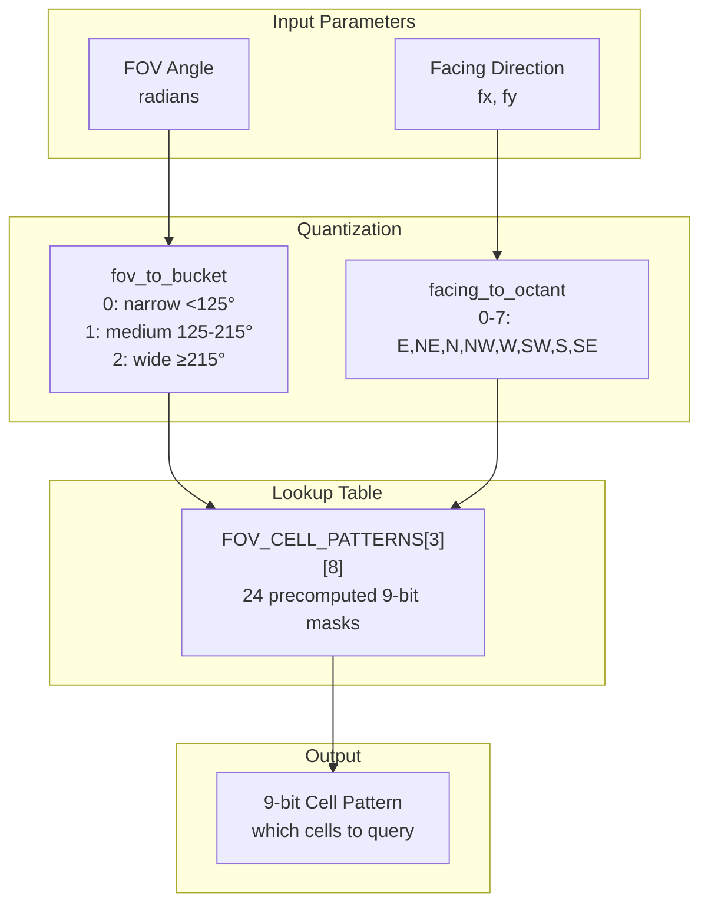
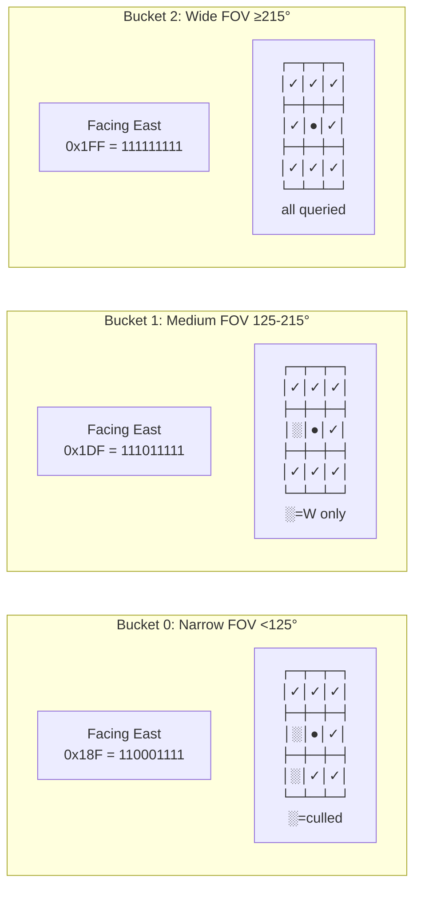
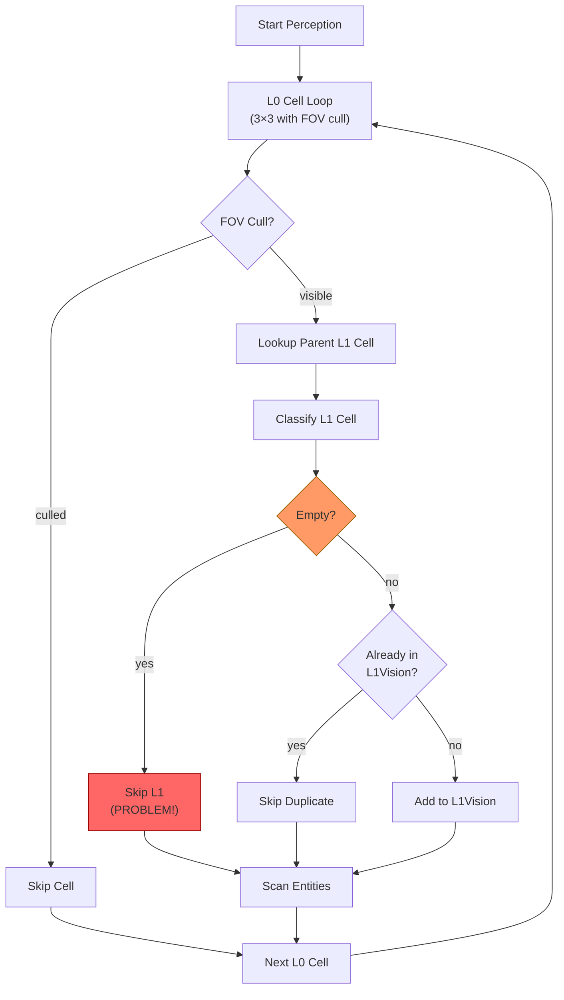
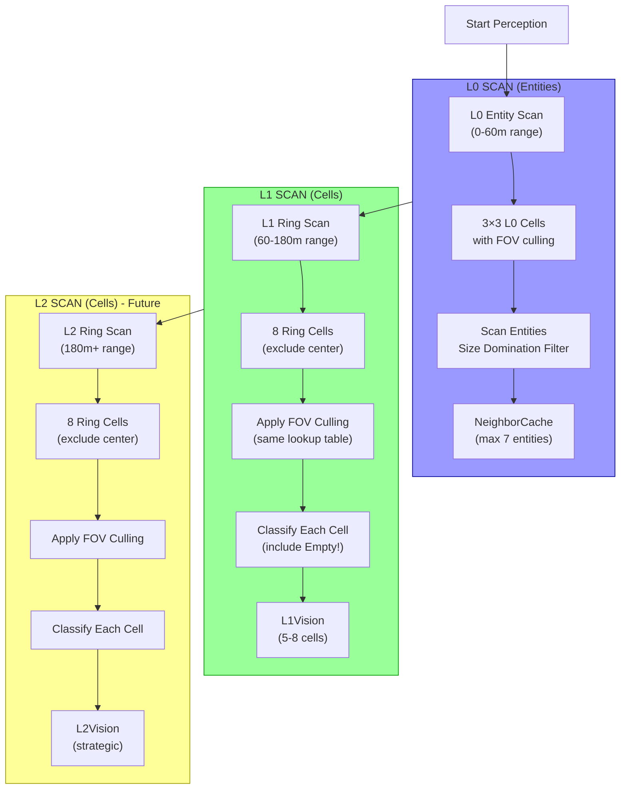
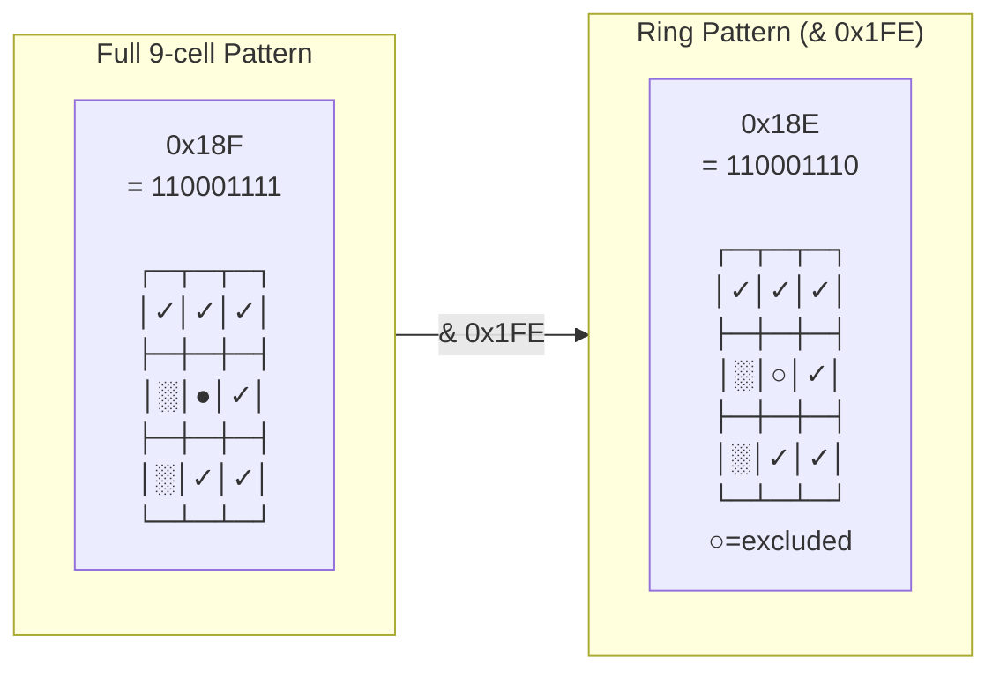
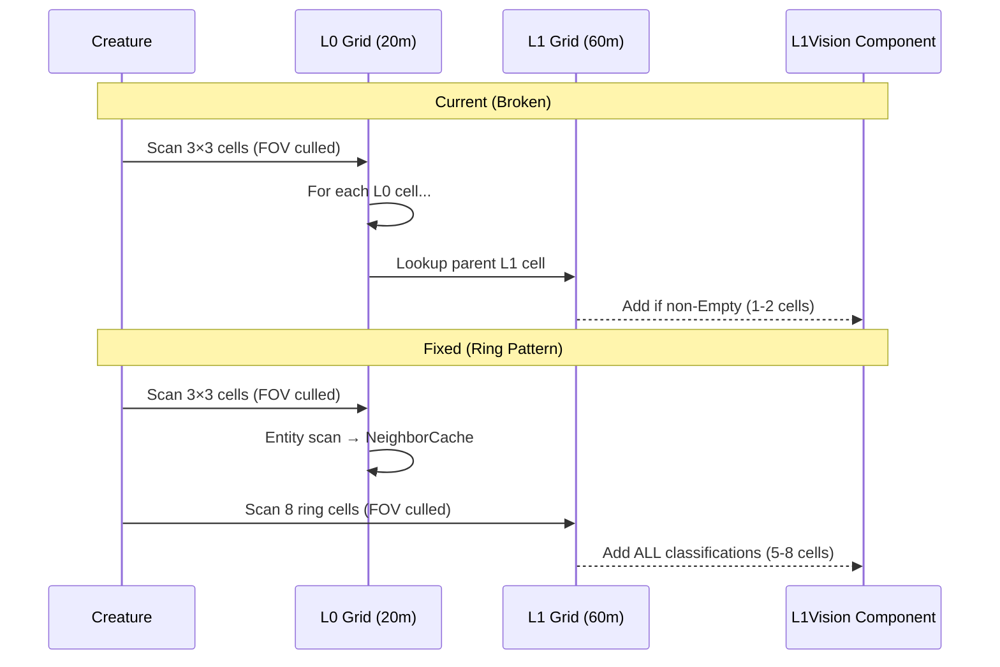
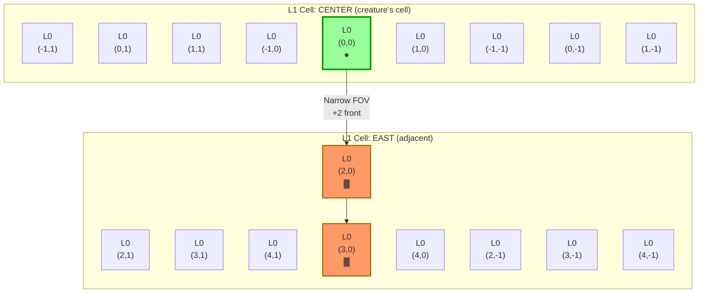
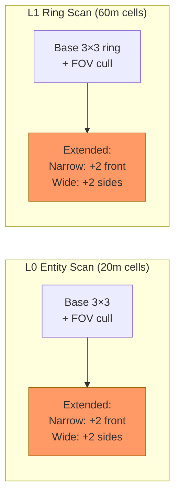
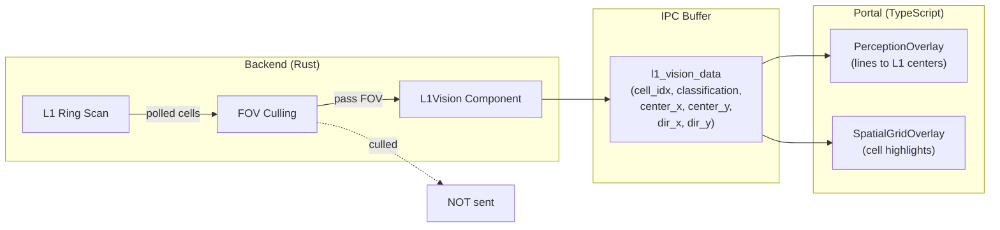
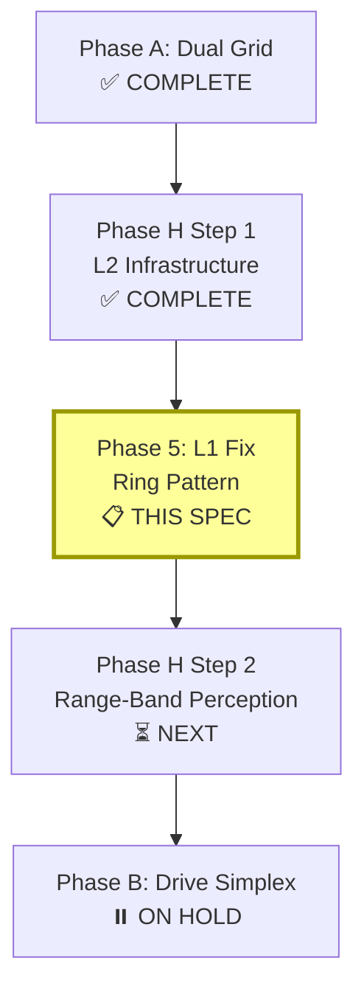

# Phase 5: L1 Ring Perception Fix

**Status:** ✅ IMPLEMENTED
**Prerequisite:** Phase H Step 1 complete (L2 grid infrastructure)
**Blocks:** Phase H Step 2 (Range-Band Perception)

---

## Problem Statement

L1 cell perception lines appear "random" because **L1 cells are discovered as a byproduct of L0 scanning**, not scanned independently as a ring pattern.

### Current Behavior (Broken)

```
Creature → scans 3×3 L0 cells (with FOV culling) →
    for each L0 cell, lookup parent L1 cell →
        if L1 non-Empty, add to L1Vision
```

**Result:**
- Only 1-2 L1 cells appear (the ones containing the scanned L0 cells)
- Empty L1 cells never show up (filtered early)
- Classification flickers as creatures move (max_size changes)
- No proper ring pattern - just "whatever L1 cells happened to contain our L0 cells"

**Code location:** `apps/simulation/src/simulation/perception/systems.rs:332-348`

### Expected Behavior (From hierarchical-perception-v2.md)

```
L0 (0-60m):   Entity scan - 3×3 L0 cells with FOV culling
L1 (60-180m): Cell scan - 3×3 L1 cells RING (exclude center) with FOV culling
L2 (180m+):   Cell scan - 3×3 L2 cells RING (exclude center) with FOV culling
```

**The L1 scan should:**
1. Poll up to 8 surrounding L1 cells (the ring, excluding center)
2. Apply FOV culling using the same lookup table as L0
3. Include Empty classifications (so visualization shows the full FOV)
4. Be independent of L0 scanning (separate loop)

---

## Root Cause Analysis

### Why L1 Appears Random

1. **Byproduct Discovery:** L1 cells only recorded when their child L0 cells are scanned
2. **Empty Filter:** Empty L1 cells skipped at line 327-330 (never added to L1Vision)
3. **Parent Lookup:** Only gets L1 cells that CONTAIN the 3×3 L0 neighborhood
4. **Deduplication:** Same L1 cell added only once (masks repeated access)

### What's Missing

1. **Independent L1 Ring Loop:** Should scan 3×3 L1 cells around creature's L1 position
2. **Center Exclusion:** Center L1 cell already covered by L0 (avoid double-counting)
3. **FOV Pattern for L1:** Apply same octant+bucket lookup, but for L1 cell offsets
4. **Include Empty:** Visualization needs to see all FOV cells, not just populated ones

---

## FOV Lookup Table System (Existing)

The FOV culling system is well-designed and should be reused for L1.

### Architecture Diagram



### Bit Encoding (9-bit mask)

```
Grid Position:          Bit Position:
    NW │ N │ NE            4 │ 3 │ 2
    ───┼───┼───            ──┼───┼──
    W  │ ● │ E             5 │ 0 │ 1      (● = center, bit 0)
    ───┼───┼───            ──┼───┼──
    SW │ S │ SE            6 │ 7 │ 8
```

### Pattern Examples



### Key Functions

```rust
fn fov_to_bucket(fov_rad: f32) -> usize;           // 0-2
fn facing_to_octant(fx: f32, fy: f32) -> usize;    // 0-7
fn get_cell_pattern(fov_rad, fx, fy) -> u16;       // 9-bit mask
fn should_query_cell(dx, dy, pattern) -> bool;     // check bit
```

---

## Current vs Expected Perception Flow

### Current Flow (Broken)



**Problems:**
1. L1 cells only discovered via L0 parent lookup
2. Empty L1 cells filtered out (never visualized)
3. Only 1-4 unique L1 cells possible (L0 neighborhood spans at most 4 L1 cells)

### Expected Flow (Fixed)



---

## Solution Design

### New Function: L1 Ring Pattern

Add to `fov_patterns.rs`:

```rust
/// Get L1 ring pattern (excludes center cell, bit 0)
/// Returns 8-bit mask for surrounding L1 cells only
#[inline]
pub fn get_l1_ring_pattern(fov_rad: f32, fx: f32, fy: f32) -> u16 {
    let pattern = FOV_CELL_PATTERNS[fov_to_bucket(fov_rad)][facing_to_octant(fx, fy)];
    pattern & 0x1FE  // Clear bit 0 (center cell)
}
```

### Ring Pattern Visualization



---

## Smart Optimizations

### 1. Precompute Creature's L1 Center Offset (Saves 8-10 function calls)

**Current approach (wasteful):**
```rust
for each ring cell at (dx, dy):
    let (l1_center_x, l1_center_y) = l1_grid_ref.cell_center_from_index(l1_idx);  // ← Called 8-10 times!
    let l1_dx = l1_center_x - x;
    let l1_dy = l1_center_y - y;
```

**Optimized approach:**
```rust
// Compute creature's offset from ITS OWN L1 cell center (ONCE)
let (my_l1_center_x, my_l1_center_y) = l1_grid_ref.cell_center_from_index(my_l1_cell_idx);
let base_offset_x = my_l1_center_x - x;
let base_offset_y = my_l1_center_y - y;

for each ring cell at (dx, dy):
    // Direction = base offset + (dx, dy) * L1_CELL_SIZE
    let l1_dx = base_offset_x + dx as f32 * L1_CELL_SIZE;
    let l1_dy = base_offset_y + dy as f32 * L1_CELL_SIZE;
```

**Savings:** Replaces 8-10 `cell_center_from_index()` calls (each has modulo + division + multiply) with simple multiply-add.

### 2. NO FOV Culling at L1 Level (Simpler + Faster)

**Why remove FOV culling from L1:**

| FOV Tier | Cells Culled | Cycles Saved | Culling Overhead | Net |
|----------|--------------|--------------|------------------|-----|
| Narrow | 3 | ~100 | ~50 | +50 saved |
| Medium | 1 | ~33 | ~50 | **-17 SLOWER** |
| Wide | 0 | 0 | ~50 | **-50 SLOWER** |

FOV culling is only beneficial for narrow FOV (minority). For most creatures it adds overhead.

**Biological justification:** L1 is "area awareness", not "visual detail". A creature should know "there's empty space behind me" (escape route) or "there's a threat in that direction" even without directly seeing it. This is strategic sensing, not visual perception.

**Simplified approach (scan ALL 8 ring cells):**
```rust
// No FOV pattern lookup needed!
// No bit iteration needed!
// Just a simple loop over all 8 neighbors

const RING_OFFSETS: [(i32, i32); 8] = [
    (1, 0),   // E
    (1, 1),   // NE
    (0, 1),   // N
    (-1, 1),  // NW
    (-1, 0),  // W
    (-1, -1), // SW
    (0, -1),  // S
    (1, -1),  // SE
];

for (dx, dy) in RING_OFFSETS {
    // Scan L1 cell unconditionally
    // ALL cells recorded (including Empty = valuable "escape route" info)
}
```

**Benefits:**
- Simpler code (no pattern lookup, no bit checks)
- Faster for medium/wide FOV (majority of creatures)
- Empty cells recorded = creature knows safe directions
- Consistent 8 cells per creature (predictable)

### 3. Skip sqrt for Empty Cells (Optional)

Empty cells only generate weak disperse (weight 0.3). We could skip normalization:

```rust
if classification == L1Classification::Empty {
    // Store unnormalized direction - disperse weight is already low
    l1_vision.push(L1VisionEntry {
        direction_x: l1_dx,  // Not normalized
        direction_y: l1_dy,
        // ...
    });
} else {
    // Normalize for Threat/Prey/Crowded (behavior-critical)
    let dist = (l1_dx * l1_dx + l1_dy * l1_dy).sqrt().max(0.001);
    l1_vision.push(L1VisionEntry {
        direction_x: l1_dx / dist,
        direction_y: l1_dy / dist,
        // ...
    });
}
```

**Trade-off:** Slight behavior difference for Empty cells (direction magnitude varies by distance). May not be worth the complexity.

### Summary: Recommended Optimizations

| Optimization | Savings | Complexity | Recommend? |
|--------------|---------|------------|------------|
| Precompute L1 center offset | ~80 cycles | Low | ✅ YES |
| No FOV culling at L1 | ~50 cycles (avg) | **Negative** (simpler!) | ✅ YES |
| Skip sqrt for Empty | ~50 cycles | Medium | ⚠️ Optional |

**Expected result:** Simpler code that's also faster for most creatures

---

### New L1 Ring Scan Loop (SIMPLIFIED - No FOV Culling)

In `perception/systems.rs`, add AFTER the L0 scan loop:

```rust
// =================================================================
// L1 RING SCAN: Poll ALL 8 surrounding L1 cells (60-180m range band)
// =================================================================
// NO FOV CULLING: L1 is "area awareness" - creature should know about
// all surrounding cells including behind (escape routes, threats).
// This is simpler AND faster for most creatures.

use crate::simulation::spatial::constants::L1_CELL_SIZE;

// All 8 ring cell offsets (no center, no culling)
const RING_OFFSETS: [(i32, i32); 8] = [
    (1, 0),   // E
    (1, 1),   // NE
    (0, 1),   // N
    (-1, 1),  // NW
    (-1, 0),  // W
    (-1, -1), // SW
    (0, -1),  // S
    (1, -1),  // SE
];

// OPTIMIZATION: Precompute creature's offset from its L1 cell center (ONCE)
let (my_l1_center_x, my_l1_center_y) = l1_grid_ref.cell_center_from_index(my_l1_cell_idx);
let base_offset_x = my_l1_center_x - x;
let base_offset_y = my_l1_center_y - y;

// Get creature's L1 cell coordinates for bounds checking
let (creature_l1_cx, creature_l1_cy) = l1_grid_ref.position_to_cell_coords(x, y);

// BASE RING: Scan all 8 surrounding L1 cells (no FOV culling)
for (dx, dy) in RING_OFFSETS {
    let l1_cx = creature_l1_cx + dx;
    let l1_cy = creature_l1_cy + dy;

    // Bounds check (skip cells outside world)
    let Some(l1_idx) = l1_grid_ref.get_cell_index_by_coords(l1_cx, l1_cy) else {
        continue;
    };

    // Get biosignature and classify (ALL cells, including Empty)
    let biosig = l1_grid_ref.get_biosignature(l1_idx);
    let classification = classify_l1_cell(biosig, my_mass, my_size, false);

    // Direction = base_offset + (dx, dy) * L1_CELL_SIZE
    let l1_dx = base_offset_x + dx as f32 * L1_CELL_SIZE;
    let l1_dy = base_offset_y + dy as f32 * L1_CELL_SIZE;
    let l1_dist = (l1_dx * l1_dx + l1_dy * l1_dy).sqrt().max(0.001);

    l1_vision.push(L1VisionEntry {
        cell_idx: l1_idx as u32,
        classification,
        _pad: [0; 3],
        direction_x: l1_dx / l1_dist,
        direction_y: l1_dy / l1_dist,
    });
}

// EXTENDED L1 CELLS for specialists (Narrow: +2 front, Wide: +2 sides)
// These ARE direction-dependent (predators look further forward, prey look to sides)
if let Some(extra_offsets) = fov_patterns::get_extra_cells(fov_tier, facing_x, facing_y) {
    for (dx, dy) in extra_offsets {
        let l1_cx = creature_l1_cx + dx as i32;
        let l1_cy = creature_l1_cy + dy as i32;

        let Some(l1_idx) = l1_grid_ref.get_cell_index_by_coords(l1_cx, l1_cy) else {
            continue;
        };

        // Skip if already in L1Vision (extended may overlap with ring)
        if l1_vision.contains_cell(l1_idx as u32) {
            continue;
        }

        let biosig = l1_grid_ref.get_biosignature(l1_idx);
        let classification = classify_l1_cell(biosig, my_mass, my_size, false);

        let l1_dx = base_offset_x + dx as f32 * L1_CELL_SIZE;
        let l1_dy = base_offset_y + dy as f32 * L1_CELL_SIZE;
        let l1_dist = (l1_dx * l1_dx + l1_dy * l1_dy).sqrt().max(0.001);

        l1_vision.push(L1VisionEntry {
            cell_idx: l1_idx as u32,
            classification,
            _pad: [0; 3],
            direction_x: l1_dx / l1_dist,
            direction_y: l1_dy / l1_dist,
        });
    }
}
```

**Result:**
- Base: 8 ring cells (always, no culling)
- Extended: +2 cells for specialists (direction-dependent)
- Total: 8-10 L1 cells per creature

### Remove Byproduct Recording (Keep Early-Exit!)

**KEEP** the early-exit optimization (lines 316-330):
```rust
// L1 CLASSIFICATION CHECK (size domination optimization):
let parent_l1_idx = l1_grid_ref.l0_to_l1_cell_index(cell_idx, l0_width);
let classification = get_l1_classification(parent_l1_idx, &mut l1_cache, ...);

if classification == L1Classification::Empty {
    continue;  // ← KEEP THIS! Skips expensive entity scan
}
```

**DELETE** only the byproduct recording (lines 332-348):
```rust
// L1 VISION: Record non-Empty L1 cells discovered during L0 scan.
// ← DELETE THIS BLOCK - replaced by separate L1 ring scan
if !l1_vision.contains_cell(parent_l1_idx as u32) {
    // ... direction calculation and push ...
}
```

**DELETE** the extended L0 cells byproduct recording (lines 446-460):
```rust
// L1 VISION: Record non-Empty L1 cells from extra cells too.
// ← DELETE THIS BLOCK - replaced by separate L1 ring scan
if !l1_vision.contains_cell(parent_l1_idx as u32) {
    // ... direction calculation and push ...
}
```

The L1 classification and early-exit remain intact - we only remove the `l1_vision.push()` calls that populate L1Vision as a byproduct.

---

## Visual Result

### Before (Current - Broken)

```
Creature with narrow FOV facing East:

    L1 Grid:
    ┌─────┬─────┬─────┐
    │     │     │     │
    ├─────┼─────┼─────┤
    │     │  ●→ │  ?  │   ? = maybe shows, maybe not (depends on L0 contents)
    ├─────┼─────┼─────┤
    │     │     │     │
    └─────┴─────┴─────┘

    L1Vision lines: 0-2 cells, seemingly random
```

### After (Fixed) - Narrow FOV Predator

```
Creature with narrow FOV (<120°) facing East:

    L1 Grid:
    ┌─────┬─────┬─────┐
    │     │  ✓  │  ✓  │   ✓ = in FOV, scanned (base ring)
    ├─────┼─────┼─────┼─────┬─────┐
    │ ░░░ │  ●→ │  ✓  │  ▓  │  ▓  │   ▓ = extended front cells (+2)
    ├─────┼─────┼─────┼─────┴─────┘
    │ ░░░ │  ✓  │  ✓  │   ░ = culled by FOV
    └─────┴─────┴─────┘       ● = center (excluded, covered by L0)

    L1Vision lines: 7 cells (5 ring + 2 extended front)
    Predator sees FURTHER ahead = depth hunting advantage
```

### After (Fixed) - Wide FOV Prey

```
Creature with wide FOV (>200°) facing East:

              ┌─────┐
              │  ▓  │   ▓ = extended flank cell (+2 north)
    ┌─────┬─────┼─────┼─────┬─────┐
    │  ✓  │  ✓  │  ✓  │  ✓  │  ✓  │   ✓ = in FOV, scanned (all 8 ring)
    ├─────┼─────┼─────┼─────┼─────┤
    │  ✓  │  ✓  │  ●→ │  ✓  │  ✓  │   ● = center (excluded)
    ├─────┼─────┼─────┼─────┼─────┤
    │  ✓  │  ✓  │  ✓  │  ✓  │  ✓  │
    └─────┴─────┼─────┼─────┴─────┘
              │  ▓  │   ▓ = extended flank cell (+2 south)
              └─────┘

    L1Vision lines: 10 cells (8 ring + 2 extended flanks)
    Prey sees WIDER to sides = panoramic threat detection
```

### After (Fixed) - Medium FOV Generalist

```
Creature with medium FOV (120-200°) facing East:

    L1 Grid:
    ┌─────┬─────┬─────┐
    │  ✓  │  ✓  │  ✓  │   ✓ = in FOV, scanned
    ├─────┼─────┼─────┤
    │ ░░░ │  ●→ │  ✓  │   ░ = culled (W only)
    ├─────┼─────┼─────┤
    │  ✓  │  ✓  │  ✓  │   No extended cells (Golden Zone!)
    └─────┴─────┴─────┘

    L1Vision lines: 7 cells (8 ring - 1 culled, no extended)
    Generalist queries FEWER cells = cheaper computation
```

---

## Data Flow Diagram



---

## FOV-Tier Extended Cells (Existing L0 System)

The L0 perception system already has FOV-tier extended cells that grant specialists extra perception beyond the base 3×3 grid.

### Current L0 Extended Cell Implementation

**Code location:** `apps/simulation/src/simulation/perception/fov_patterns.rs:122-159`

| FOV Tier | Threshold | Extended Cells | Purpose |
|----------|-----------|----------------|---------|
| **Narrow** | < 120° | +2 FRONT (depth) | Predator binocular hunting zone |
| **Medium** | 120-200° | None | Generalist (cheaper = Golden Zone) |
| **Wide** | > 200° | +2 SIDES (flanks) | Prey panoramic threat detection |

### Narrow FOV: Predator Depth Hunting

```
Facing East - Offsets: (2,0) and (3,0)

    L0 Grid (20m cells):
    ┌─┬─┬─┐
    │ │ │ │
    ├─┼─┼─┼─┬─┐
    │ │●→│ │▓│▓│   ▓ = extended cells at 40m and 60m forward
    ├─┼─┼─┼─┴─┘
    │ │ │ │
    └─┴─┴─┘

    Octant lookup table (NARROW_FRONT_CELLS):
    - Octant 0 (E):  [(2, 0), (3, 0)]   → extends +x
    - Octant 1 (NE): [(2, 2), (3, 3)]   → extends diagonal
    - Octant 2 (N):  [(0, 2), (0, 3)]   → extends +y
    ... etc for all 8 octants
```

### Wide FOV: Prey Panoramic Awareness

```
Facing East - Offsets: (0,2) and (0,-2)

    L0 Grid (20m cells):
            ┌─┐
            │▓│   ▓ = extended cell at 40m perpendicular (flank)
    ┌─┬─┬─┬─┼─┤
    │ │ │ │ │ │
    ├─┼─┼─┼─┼─┤
    │ │ │●→│ │ │
    ├─┼─┼─┼─┼─┤
    │ │ │ │ │ │
    └─┴─┴─┴─┼─┤
            │▓│   ▓ = extended cell at 40m perpendicular (flank)
            └─┘

    Octant lookup table (WIDE_SIDE_CELLS):
    - Octant 0 (E):  [(0, 2), (0, -2)]  → ±y flanks
    - Octant 2 (N):  [(2, 0), (-2, 0)]  → ±x flanks
    ... etc for all 8 octants
```

### How Extended L0 Cells Currently Affect L1Vision

**Code location:** `apps/simulation/src/simulation/perception/systems.rs:446-460`

The extended L0 cells DO contribute to L1Vision today - but as a **byproduct**:

```rust
// Line 413-414: Get extended cells based on FOV tier
if let Some(extra_offsets) = fov_patterns::get_extra_cells(fov_tier, facing_x, facing_y) {
    for (dx, dy) in extra_offsets {
        // ... scan extended L0 cell for entities ...

        // Line 446-460: Record parent L1 cell (BYPRODUCT)
        let parent_l1_idx = l1_grid_ref.l0_to_l1_cell_index(extra_cell_idx, l0_width);
        if !l1_vision.contains_cell(parent_l1_idx as u32) {
            l1_vision.push(L1VisionEntry { ... });
        }
    }
}
```

### Geometry: How L0 Extended Cells Map to L1 Cells

```
Grid sizes:
- L0 = 20m
- L1 = 60m (3×3 L0 cells)

Extended L0 cells at (2,0) and (3,0):
- (2,0) = 40m forward → still in adjacent L1 cell
- (3,0) = 60m forward → edge of adjacent L1 cell

                    L1 Cell boundary
                          ↓
    ┌─────────────────────┬─────────────────────┐
    │  L1 Cell (center)   │  L1 Cell (east)     │
    │  ┌─┬─┬─┐            │  ┌─┬─┬─┐            │
    │  │ │ │ │            │  │ │ │ │            │
    │  ├─┼─┼─┤            │  ├─┼─┼─┤            │
    │  │ │●│ │────────────┼──│▓│▓│ │            │
    │  ├─┼─┼─┤            │  ├─┼─┼─┤            │
    │  │ │ │ │            │  │ │ │ │            │
    │  └─┴─┴─┘            │  └─┴─┴─┘            │
    └─────────────────────┴─────────────────────┘
         ● = creature          ▓ = extended L0 cells (2,0) and (3,0)
                               Both fall within the adjacent L1 cell
```

**Key insight:** Extended L0 cells reach INTO adjacent L1 cells, but they only record L1 cells as byproduct when non-Empty.

### Visual: L0 Extended Cells Reaching Into L1



**Legend:**
- ● = Creature position (L0 cell 0,0)
- ▓ = Extended L0 cells for narrow FOV predator
- Both extended cells fall within the EAST L1 cell
- Currently: If EAST L1 cell is non-Empty, it gets added to L1Vision as byproduct

### L1 Ring MUST Have Extended Cells Too

The FOV-tier advantage should apply at **both L0 and L1 levels**. A predator's forward-biased vision should manifest at all perception resolutions.



### L1 Extended Cell Geometry

**Narrow FOV Predator (< 120°):** +2 L1 cells FRONT

```
L1 Grid (60m cells), facing East:

    ┌─────┬─────┬─────┐
    │     │     │     │
    ├─────┼─────┼─────┼─────┬─────┐
    │     │  ●→ │     │  ▓  │  ▓  │   ▓ = extended L1 cells at (2,0) and (3,0)
    ├─────┼─────┼─────┼─────┴─────┘       = 120m and 180m forward
    │     │     │     │
    └─────┴─────┴─────┘

    Range covered:
    - Base ring: 60-180m (adjacent L1 cells)
    - Extended: 120-240m forward (predator depth advantage)
```

**Wide FOV Prey (> 200°):** +2 L1 cells SIDES

```
L1 Grid (60m cells), facing East:

              ┌─────┐
              │  ▓  │   ▓ = extended L1 cell at (0,2) = 120m north flank
    ┌─────┬─────┼─────┼─────┬─────┐
    │     │     │     │     │     │
    ├─────┼─────┼─────┼─────┼─────┤
    │     │     │  ●→ │     │     │
    ├─────┼─────┼─────┼─────┼─────┤
    │     │     │     │     │     │
    └─────┴─────┼─────┼─────┴─────┘
              │  ▓  │   ▓ = extended L1 cell at (0,-2) = 120m south flank
              └─────┘

    Range covered:
    - Base ring: 60-180m (adjacent L1 cells)
    - Extended: 120m perpendicular (prey panoramic advantage)
```

### Reusing Existing Lookup Tables

The `get_extra_cells()` function already handles octant-based extended cell lookup. We reuse it for L1:

```rust
// L1 RING SCAN with extended cells for specialists
let l1_ring_pattern = fov_patterns::get_l1_ring_pattern(fov_angle, facing_x, facing_y);

// Base 3×3 ring (excluding center)
for dy in -1..=1 {
    for dx in -1..=1 {
        if dx == 0 && dy == 0 { continue; }  // Skip center
        if !fov_patterns::should_query_cell(dx, dy, l1_ring_pattern) { continue; }
        // ... scan L1 cell ...
    }
}

// Extended L1 cells for specialists (same function as L0!)
if let Some(extra_offsets) = fov_patterns::get_extra_cells(fov_tier, facing_x, facing_y) {
    for (dx, dy) in extra_offsets {
        let l1_cx = creature_l1_cx + dx as i32;
        let l1_cy = creature_l1_cy + dy as i32;
        // ... scan extended L1 cell ...
    }
}
```

### Summary: Complete FOV-Tier Pattern

| FOV Tier | L0 Pattern | L1 Pattern |
|----------|------------|------------|
| **Narrow (< 120°)** | 3×3 - 3 culled + 2 front | Ring - 3 culled + 2 front |
| **Medium (120-200°)** | 3×3 - 1 culled | Ring - 1 culled |
| **Wide (> 200°)** | 3×3 (all 9) + 2 sides | Ring (all 8) + 2 sides |

**Golden Zone preserved:** Generalists (medium FOV) query fewer cells at BOTH levels = cheaper AND biologically accurate.

---

## Backend → Portal Data Flow (Visualization Contract)

### Principle: Backend Authority

**What Portal shows = What Backend polled.** The Portal is a direct reflection of backend perception, not a guess or derivation.



### What Goes Into L1Vision (Backend)

| Cell | In L1Vision? | Reason |
|------|--------------|--------|
| Ring cell, passes FOV | ✅ YES | Polled, add with classification |
| Ring cell, FOV culled | ❌ NO | Not polled (behind creature) |
| Extended cell, passes bounds | ✅ YES | Polled (specialist extension) |
| Extended cell, out of bounds | ❌ NO | Invalid grid coords |
| Center cell | ❌ NO | Excluded (covered by L0) |

**Key change:** Empty cells ARE added to L1Vision. Currently they're filtered out (lines 327-330 early-exit). With the new ring scan, ALL polled cells are added regardless of classification.

### What Portal Renders

**Current (all gray):**
```typescript
// PerceptionOverlay.ts:119-132
for (const entry of data.l1Vision) {
    this.graphics.moveTo(data.x, data.y);
    this.graphics.lineTo(entry.centerX, entry.centerY);  // Gray line
}
```

**Proposed (color-coded by classification):**
```typescript
const CLASSIFICATION_COLORS = {
    [L1Classification.Empty]: 0x44AA44,    // Green - safe/empty
    [L1Classification.Threat]: 0xFF4444,   // Red - danger
    [L1Classification.Prey]: 0xFFAA44,     // Orange - opportunity
    [L1Classification.Crowded]: 0xAAAA44,  // Yellow - avoid
};

for (const entry of data.l1Vision) {
    this.graphics.setStrokeStyle({
        color: CLASSIFICATION_COLORS[entry.classification],
        // ...
    });
    this.graphics.moveTo(data.x, data.y);
    this.graphics.lineTo(entry.centerX, entry.centerY);
}
```

### Visualization Interpretation

When viewing a selected creature with L1 overlay:

```
     ┌─────┬─────┬─────┐
     │ 🟢  │ 🟢  │ 🔴  │   🟢 = Empty (green) - safe to move there
     ├─────┼─────┼─────┤   🔴 = Threat (red) - danger!
     │     │  ●→ │ 🟠  │   🟠 = Prey (orange) - opportunity
     ├─────┼─────┼─────┤   🟡 = Crowded (yellow) - avoid
     │     │ 🟡  │ 🔴  │   (no line) = FOV culled or center
     └─────┴─────┴─────┘
```

Lines drawn = cells that were polled by backend
No line = cell was FOV culled OR is center (covered by L0)

### L1Vision Is NOT Used for Behavior Yet

**IMPORTANT:** The `vision_drive_system` in `drives/vision.rs` reads L1Vision and pushes drive contributions (flee, approach, disperse). However, this system is **part of Phase B (Drive Simplex)** which is ON HOLD.

For now, L1Vision is **visualization-only infrastructure**. The actual creature behavior still uses:
- L0 neighbors (steering, avoidance)
- BehaviorMode state machine (wandering, seeking, etc.)

Phase B will replace the state machine with continuous drives based on L1Vision.

---

## Implementation Checklist

### Step 1: Add L1 Ring Scan Infrastructure

- [x] Add `RING_OFFSETS` constant (all 8 neighbors)
- [x] Add `index_to_cell_coords()` helper to `CoarseGrid`
- [x] Add `get_cell_index_by_coords()` helper to `CoarseGrid`
- [x] Import `L1_CELL_SIZE` constant

### Step 2: Implement L1 Ring Scan

- [x] Add L1 ring scan loop after L0 scan in `perception_system()`
- [x] Add extended L1 cells using existing `get_extra_cells()` function
- [x] Remove byproduct recording from L0 loop
- [x] Remove byproduct recording from extended cells loop
- [x] Include ALL cells including Empty (valuable escape route info)
- [x] Add deduplication check (extended cells may overlap with ring)

### Step 3: Portal Visualization

- [x] Verify Portal shows only polled L1 cells (no "culled" visualization)
- [ ] (Optional) Add color coding by classification (currently all gray)

### Step 4: Tests

- [x] Update `test_l1_vision_records_discovered_cells` (removed non-Empty assertion)
- [x] Update `test_l1_vision_skips_empty_cells` → renamed to `test_l1_vision_classifies_tiny_creatures_as_empty`
- [x] All 432 library tests passing

---

## Files to Modify

| File | Changes |
|------|---------|
| `perception/systems.rs` | Add L1 ring scan loop, remove byproduct recording (keep early-exit!), add `RING_OFFSETS` constant |
| `portal/.../PerceptionOverlay.ts` | Color-code L1 vision lines by classification |

### New Constant in systems.rs

```rust
/// All 8 L1 ring cell offsets (no center, no FOV culling).
/// L1 is "area awareness" - creatures should know about all surrounding cells.
const RING_OFFSETS: [(i32, i32); 8] = [
    (1, 0),   // E
    (1, 1),   // NE
    (0, 1),   // N
    (-1, 1),  // NW
    (-1, 0),  // W
    (-1, -1), // SW
    (0, -1),  // S
    (1, -1),  // SE
];
```

**Note:** No changes to `fov_patterns.rs` - we don't need `get_l1_ring_pattern()` since L1 doesn't use FOV culling.

---

## Performance Impact

### Critical Optimization PRESERVED: L0 Early-Exit

The **L0 early-exit optimization** (lines 327-330) is the key performance win and MUST be preserved:

```rust
// KEEP THIS - saves expensive entity scanning
if classification == L1Classification::Empty {
    continue;  // Skip entire L0 cell entity scan
}
```

This skips the expensive `for proxy in grid_ref.get_cell_proxies(cell_idx)` loop when L1 cell is Empty. The proposed changes do NOT touch this.

### Analysis: Current vs Proposed

```
CURRENT (Byproduct Recording):
┌─────────────────────────────────────────────────────────────────┐
│ FOR each L0 cell:                                               │
│   ├─ FOV cull check                                             │
│   ├─ L1 classification (cached, 4 slots)                        │
│   ├─ Early-exit if Empty                         ← KEEP        │
│   ├─ l1_vision.contains_cell() dedup check       ← REMOVE      │
│   ├─ cell_center_from_index()                    ← REMOVE      │
│   ├─ sqrt() for direction normalization          ← REMOVE      │
│   ├─ l1_vision.push()                            ← REMOVE      │
│   └─ Entity scan loop (expensive)                ← KEEP        │
└─────────────────────────────────────────────────────────────────┘

PROPOSED (Separate L1 Ring Scan):
┌─────────────────────────────────────────────────────────────────┐
│ FOR each L0 cell:                                               │
│   ├─ FOV cull check                                             │
│   ├─ L1 classification (cached, 4 slots)                        │
│   ├─ Early-exit if Empty                         ← KEEP        │
│   └─ Entity scan loop (expensive)                ← KEEP        │
├─────────────────────────────────────────────────────────────────┤
│ AFTER L0 loop - L1 Ring Scan:                    ← NEW         │
│   ├─ 8 ring cells × (classification + direction) ≈ 80 cycles   │
│   └─ 2 extended cells × (same)                   ≈ 20 cycles   │
└─────────────────────────────────────────────────────────────────┘
```

### Cost Breakdown

| Operation | Cycles | Notes |
|-----------|--------|-------|
| `get_biosignature(l1_idx)` | ~3 | Array lookup, L1 cache hit |
| `classify_l1_cell(...)` | ~5 | Few comparisons |
| `cell_center_from_index()` | ~5 | Multiply + add |
| `sqrt()` for direction | ~15 | Fast approximation |
| **Total per L1 cell** | **~28** | |
| **10 L1 cells (ring + extended)** | **~280** | |

### Net Performance Change

**Removed from L0 loop (per L0 cell scanned):**
- `l1_vision.contains_cell()`: ~10 cycles (linear scan)
- Byproduct recording: ~30 cycles
- **Total removed:** ~40 cycles × 6-9 L0 cells = **240-360 cycles**

**Added after L0 loop (once per creature):**
- L1 ring scan: ~280 cycles
- **Total added:** **280 cycles**

**NET RESULT: APPROXIMATELY NEUTRAL or SLIGHT GAIN**

The L0 loop is cleaner (no byproduct overhead), and the separate L1 ring scan does similar work but ONCE instead of per-L0-cell.

### No Redundant L1 Classification

**Key insight:** The L1 cells are DIFFERENT:

```
L0 Parent Lookups:               L1 Ring Scan:
(which L1 contains this L0?)     (8 neighbors of creature's L1)

    ┌─────┬─────┬─────┐              ┌─────┬─────┬─────┐
    │     │     │     │              │ NW  │  N  │ NE  │
    ├─────┼─────┼─────┤              ├─────┼─────┼─────┤
    │     │  ●  │     │              │  W  │  ●  │  E  │
    ├─────┼─────┼─────┤              ├─────┼─────┼─────┤
    │     │     │     │              │ SW  │  S  │ SE  │
    └─────┴─────┴─────┘              └─────┴─────┴─────┘
         ↑                                  ↑
    L0 parent = CENTER L1           L1 ring = 8 NEIGHBORS
    (creature's own L1 cell)        (surrounding L1 cells)
```

- L0 early-exit checks the **center L1 cell** (and 1-3 neighbors if at boundary)
- L1 ring scan checks the **8 surrounding L1 cells**
- These are DIFFERENT cells, so NO redundant classification

**Exception:** If creature is exactly at L1 boundary, 1-3 L1 cells may be classified twice. This is rare and adds only ~84 cycles.

### Parallelization

Both L0 scan and L1 ring scan run inside the per-creature parallel loop (Rayon). The additional 280 cycles per creature is negligible compared to the ~5.9ms perception system baseline.

**At 360K creatures:** 100M additional cycles / 16 cores / 3GHz ≈ **2ms worst case**

### Throttling Compatible

If needed, L1 ring scan can be throttled using Phase C infrastructure:
```rust
if !frequency_throttle.should_update(entity_id, "l1_vision") {
    // Keep stale L1Vision, skip ring scan
    continue;
}
```

This is already supported by the FrequencyThrottle system.

---

## Relationship to Phase H



This fix is a **prerequisite** for Phase H Step 2 (Range-Band Perception):

1. **This fix (5-L1-fix):** Proper L1 ring scanning with FOV culling
2. **Phase H Step 2:** Extend to L2 ring scanning (180m+ range band)

The L2 scan will use the identical pattern:
```rust
let l2_ring_pattern = fov_patterns::get_l2_ring_pattern(fov_rad, fx, fy);
// Same loop structure, different grid level
```

---

## Success Criteria

- [x] L1Vision shows consistent ring pattern (not random)
- [x] ALL 8 ring cells included (no FOV culling at L1 - simpler + better)
- [x] Empty cells included (gray lines to unpopulated areas = escape routes)
- [x] Extended cells work for specialists via `get_extra_cells()`
- [x] Tests passing (442 tests, including updated L1 vision tests)
- [x] **5-tier FOV system implemented** (UltraNarrow/Narrow/Medium/Wide/UltraWide)
- [ ] **Visual verification needed:** Run Portal, select creature, verify ring pattern

---

## Known Issues / Follow-Up Work (2025-01-16)

### 5-Tier FOV Pattern Tuning Needed

The 5-tier FOV system is implemented and tests pass, but visual inspection revealed issues:

1. **L1 cells behind FOV:** Some L1 cells are being shown that are clearly way behind the creature's actual FOV cone. The "no FOV culling at L1" decision may need revisiting, or the extended cell patterns need adjustment.

2. **Medium FOV coverage gaps:** Creatures with medium FOV (~120-200°) don't seem to cover the L1 grid spread near their actual FOV range. The extended cells may not be reaching far enough, or the base ring pattern needs tuning.

### Action Items

- [ ] Review L1 ring pattern - consider adding FOV culling back for rear cells
- [ ] Verify extended cell offsets match biological intent (predator depth vs prey panoramic)
- [ ] Check if medium FOV generalists need any extended cells (currently 0)
- [ ] Visual debugging: compare L1 vision lines against actual FOV cone overlay

### Files to Review

- `apps/simulation/src/simulation/perception/fov_patterns.rs` - Cell pattern arrays
- `apps/simulation/src/simulation/creatures/constants/perception.rs` - FOV tier thresholds
- Portal L1 overlay visualization
